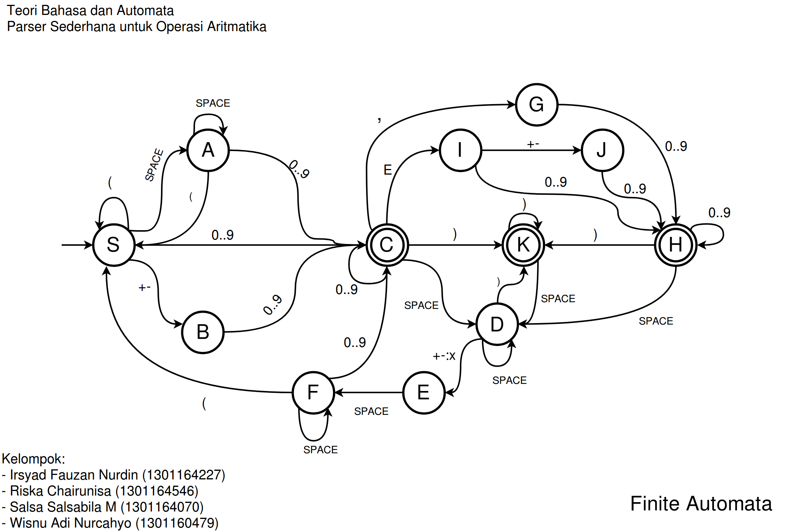

# TBAParser
A simple parser as a final task of Automata Theory and Languages at Telkom University.

## Finite Automata Design

## Run Program
- Clone this repository.
- Compile with C++11 e.g. `g++ parser.cpp -std=c++11`.
- Run the program and input your arithmetic expression.

## Note
Currently, this program is on the first phase.

## License
Licensed under The MIT License.

